# AttriPredict

员工流失预测项目，专注单模型探索，不搞 ensemble（太麻烦了 🙃）

---

## 📂 项目结构

```
AttriPredict/
├── 01_brute-force_model_search/  # 暴力模型搜索
├── 02_brute-force_lr_search/     # LR 深度调优
└── 03_stable_lr_f1_lab/          # 最终生产方案 ⭐
```

---

## 01 · Brute-Force Model Search

对模型、特征工程、编码方式、随机种子、CV 进行暴力穷举式搜索。

### v1 · Unfair Competition

11 个模型 × 多种超参 × 3 个种子 × 5 种特征工程 = **615 种组合**，跑了 270 分钟。

由于失误对树模型也做了标准化，导致系统性利好线性模型（翻车现场 😅）

<div align="center">
  
</div>

### v2 · Fair Competition

建立模型家族专属 pipeline，让所有模型公平竞争。**332 种组合**，运行 70 分钟。

<table>
  <tr>
    <td width="50%">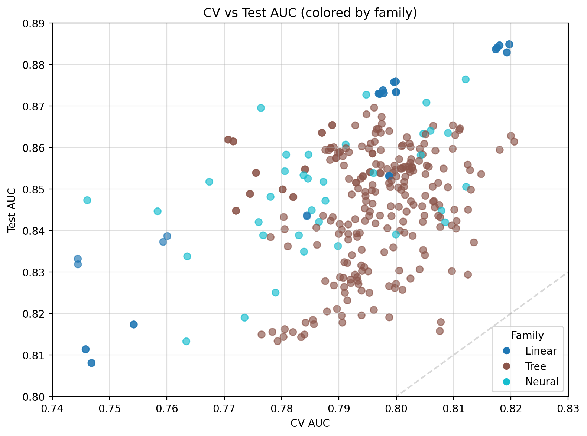</td>
    <td width="50%">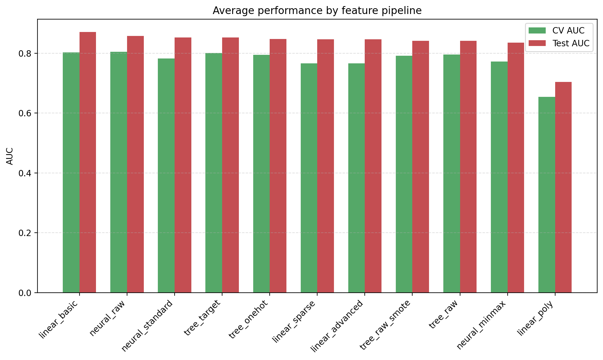</td>
  </tr>
</table>

### 结论

**LR 最稳定且表现最好**，同时可解释性优秀 → 决定深挖 LR

---

## 02 · Brute-Force LR Search

固定使用 LR，通过三次迭代寻找最优解。

### v1 · 复杂特征工程探索

使用复杂特征工程 + quantile + bins + selector + 各种 SMOTE 变体 + 多种超参组合

**TOP 3 模型**：

| 模型编号 | 描述 | Test AUC | F1 | CV 均值 | CV 标准差 | 采样器 | 正则化 |
|---------|------|----------|-----|---------|-----------|--------|--------|
| **59** | Full-stack + SMOTETomek + L2 balanced | 0.8511 | 0.6078 | 0.762 | 0.0614 | SMOTETomek | Balanced L2 |
| **52** | Quantile + bins + ADASYN → BorderlineSMOTE + L1 | 0.8856 | 0.5146 | 0.7962 | 0.0453 | BorderlineSMOTE | L1 (saga) |
| **44** | Full-stack + SMOTETomek + L2 mid | 0.8494 | 0.5893 | 0.7574 | 0.0661 | SMOTETomek | Mid L2 |

### v2 · 场景分化

针对不同业务场景（追分 vs 生产稳定性）训练专门模型：

| 模型编号 | 场景 | Test AUC | F1 | CV 均值±标准差 | 特点 |
|---------|------|----------|-----|----------------|------|
| **score_chaser** | 排行榜追分 | 0.8913 | 0.5513 | 0.7956±0.039 | 专为 AUC 调优 |
| **auc_guardian** | 生产稳定 | 0.8492 | 0.5393 | 0.7551±0.0495 | 注重 CV 稳定性 |
| **precision_guardian** | 高精度场景 | 0.8549 | 0.4896 | 0.7560±0.027 | 设置 Recall 下限 |

### v3 · 少即是多

**结论**：复杂的特征工程、特征选择、上采样反而导致模型更差 🤔

回归简单，专注四种业务标准：

| 模型编号 | 目标 | Test AUC | Test F1 | CV AUC | 采样器 | 正则化 |
|---------|------|----------|---------|--------|--------|--------|
| **score_chaser** | 最高 AUC | 0.8913 | 0.5513 | 0.7956±0.039 | SMOTE | Very High L2 |
| **auc_guardian** | CV 稳定 AUC | 0.8150 | 0.5618 | 0.7841±0.0378 | BorderlineSMOTE | L1 (saga) |
| **precision_guardian** | 高精度 | 0.7350 | 0.5517 | 0.7539±0.0484 | SMOTETomek | Balanced L2 |
| **recall_guardian** | 高召回 | 0.7589 | 0.3529 | 0.6178±0.0932 | SMOTETomek | L1 (saga) |

你看，还是不够简单，还是炸了👆

但拿到了一个能冲榜的 AUC，挺好 🥳

### 关键发现

在 ~1100 极少样本且正反例失衡的情况下：
- 单 LR 的极限约在 **AUC 0.88**
- 所有其它单模型也无法突破这个阈值
- 虽可通过极端组合达到 0.89，但不稳定且不适合业务

**现实是**：目前个人水平用单模型仍无法超越示例代码，老实把项目落地才是正道 💼

---

## 03 · Stable LR F1 Lab ⭐

**最终生产方案**：LR + 少量特征交互 + log1p + 标准化 + One Hot

### 核心特性

1. **扩展超参搜索**：102 种超参组合（C: 7个值，l1_ratio: 5个值）
2. **全方位采样对比**：测试 5 种上采样策略（结果证明不采样最好）
3. **以 F1 为优化目标**：更贴近业务需求
4. **详细 CV 统计**：mean, std, min, max 全覆盖
5. **完整测试评估**：包含 test.csv 的详细分类报告

### 最终性能

```
Best Sampler: None (不过采样)
CV F1:        0.5764 ± 0.0721
CV ROC-AUC:   0.8256 ± 0.0335
Test ROC-AUC: 0.8850
Test F1:      0.6226 (threshold=0.40)
Test Accuracy: 0.8857
```

### 可视化结果

#### CV vs Test 性能对比

<table>
  <tr>
    <td width="50%">
      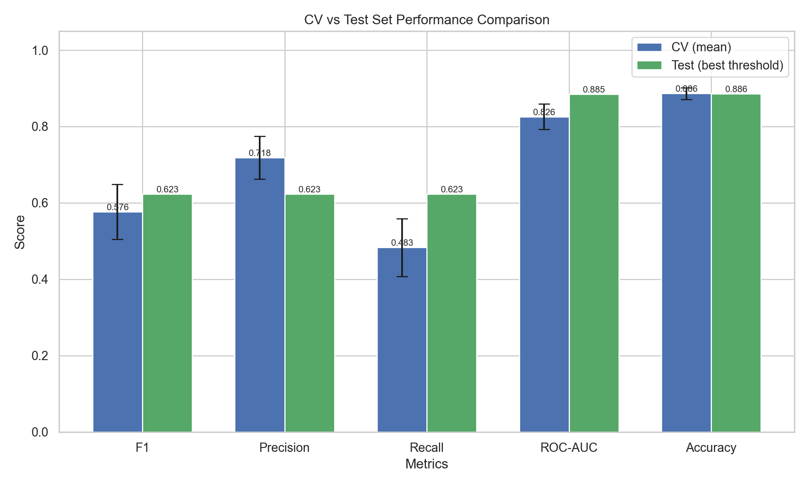
      <p align="center"><b>五大指标对比</b></p>
    </td>
    <td width="50%">
      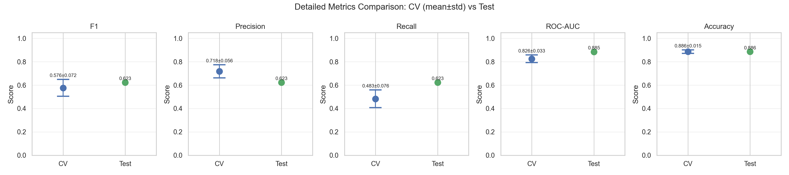
      <p align="center"><b>详细指标分布</b></p>
    </td>
  </tr>
</table>

#### 采样策略对比

<table>
  <tr>
    <td width="50%">
      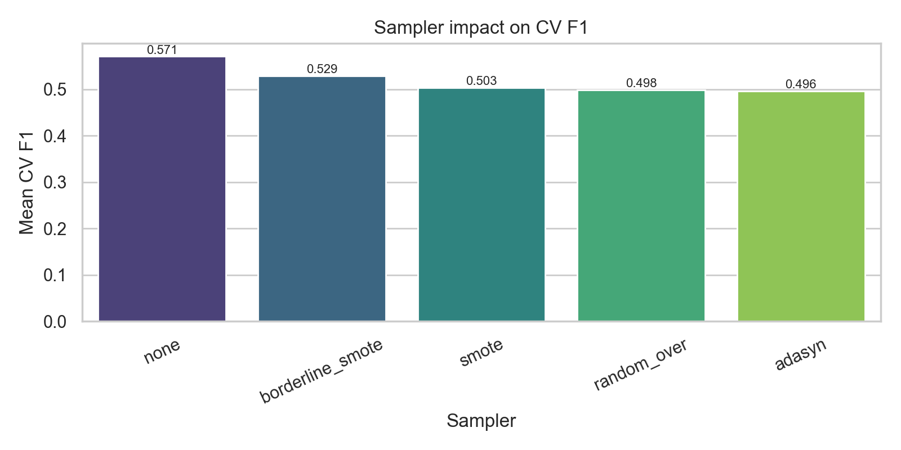
      <p align="center"><b>采样器 F1 对比</b></p>
    </td>
    <td width="50%">
      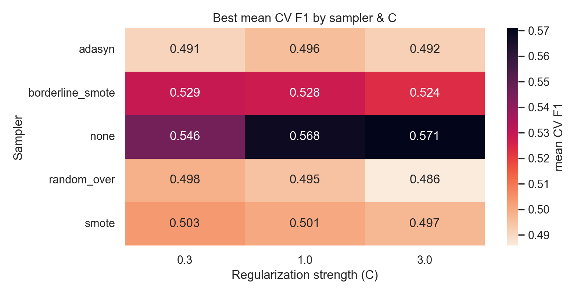
      <p align="center"><b>采样器×正则化热力图</b></p>
    </td>
  </tr>
</table>

#### 模型性能评估

<table>
  <tr>
    <td width="50%">
      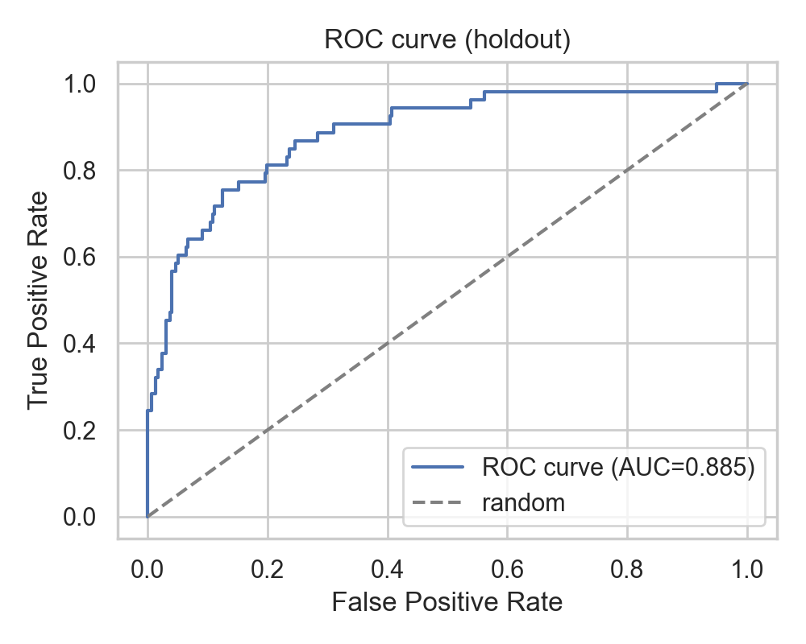
      <p align="center"><b>ROC 曲线</b></p>
    </td>
    <td width="50%">
      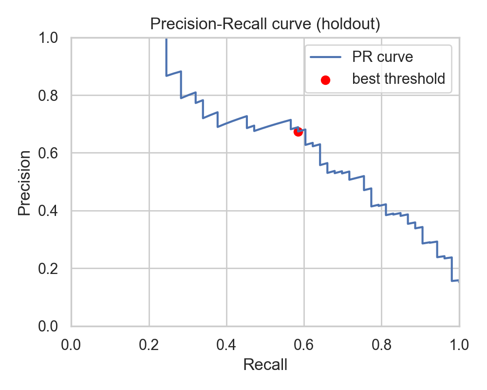
      <p align="center"><b>Precision-Recall 曲线</b></p>
    </td>
  </tr>
  <tr>
    <td width="50%">
      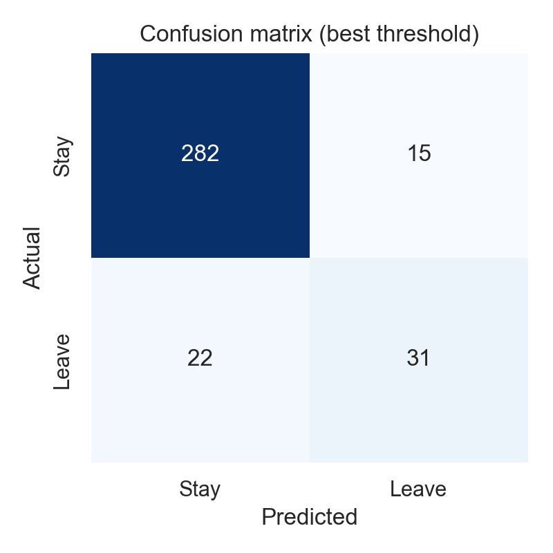
      <p align="center"><b>混淆矩阵</b></p>
    </td>
    <td width="50%">
      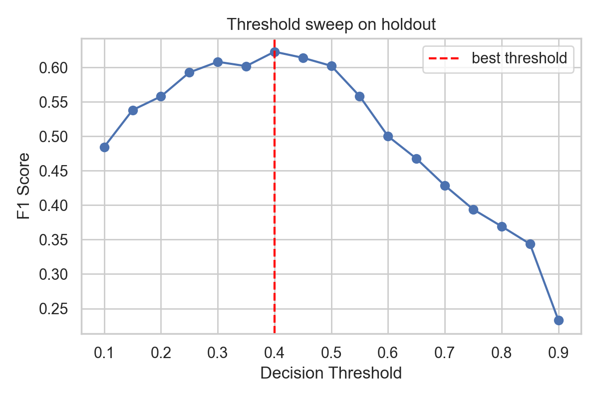
      <p align="center"><b>阈值扫描</b></p>
    </td>
  </tr>
  <tr>
    <td width="50%">
      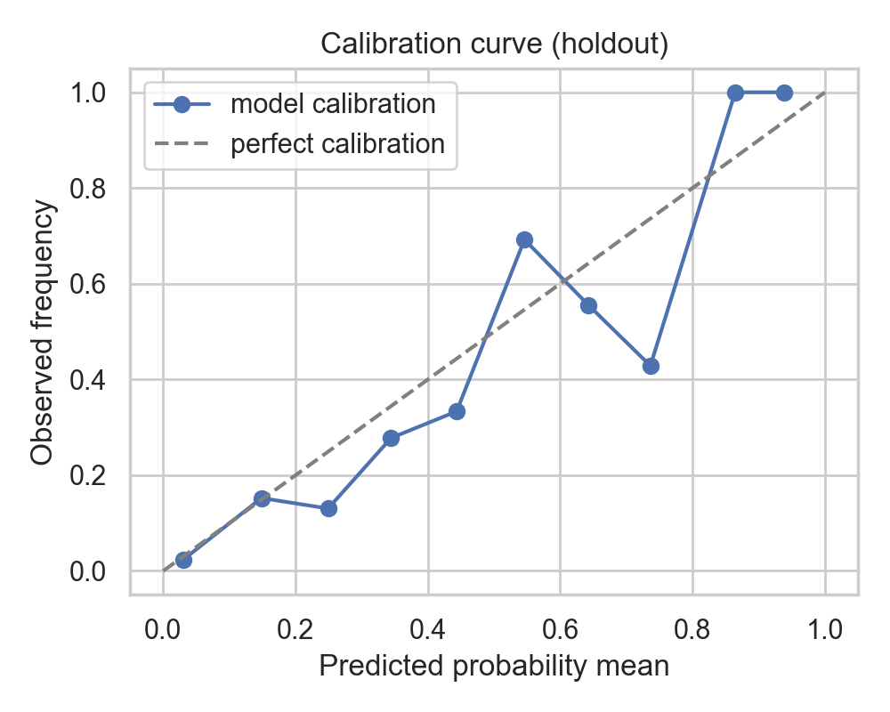
      <p align="center"><b>校准曲线</b></p>
    </td>
    <td width="50%">
      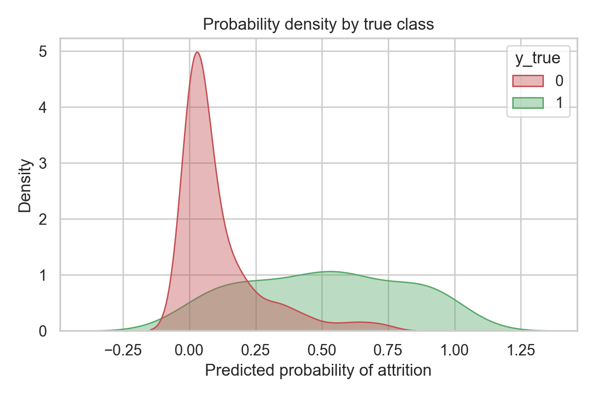
      <p align="center"><b>概率密度分布</b></p>
    </td>
  </tr>
</table>

#### 特征重要性

<div align="center">
  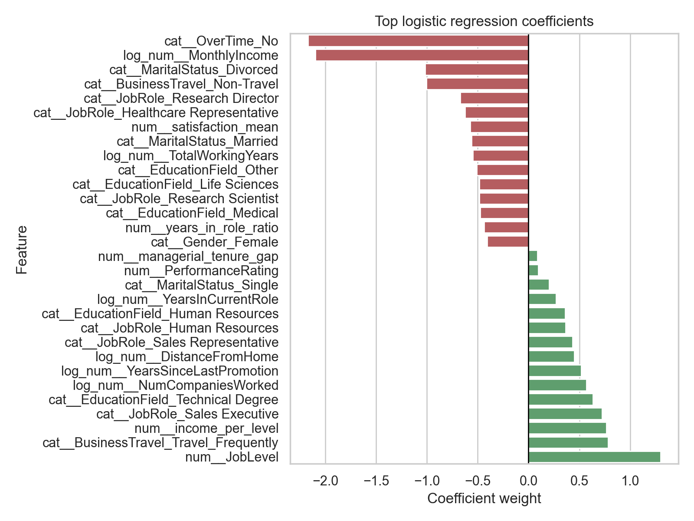
  <p><b>Top 系数（红增绿减）</b></p>
</div>

---

## 💡 总结

### 还不如从一开始就去玩多模型养蛊
