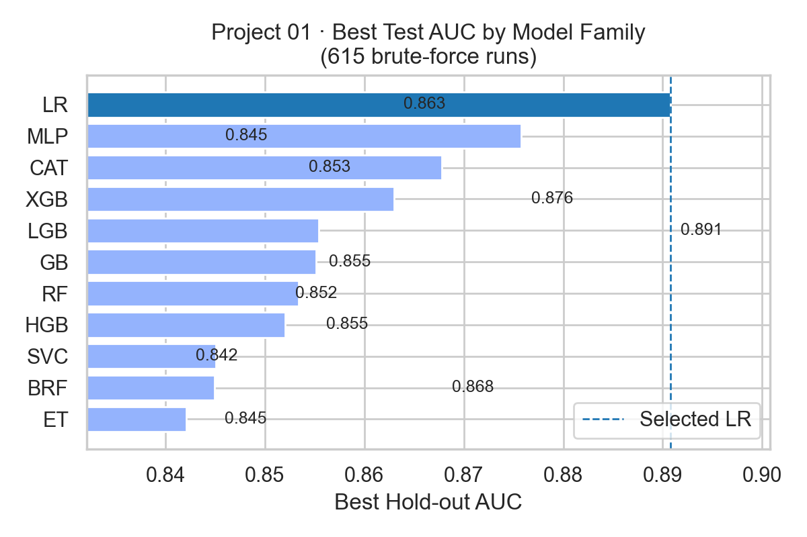
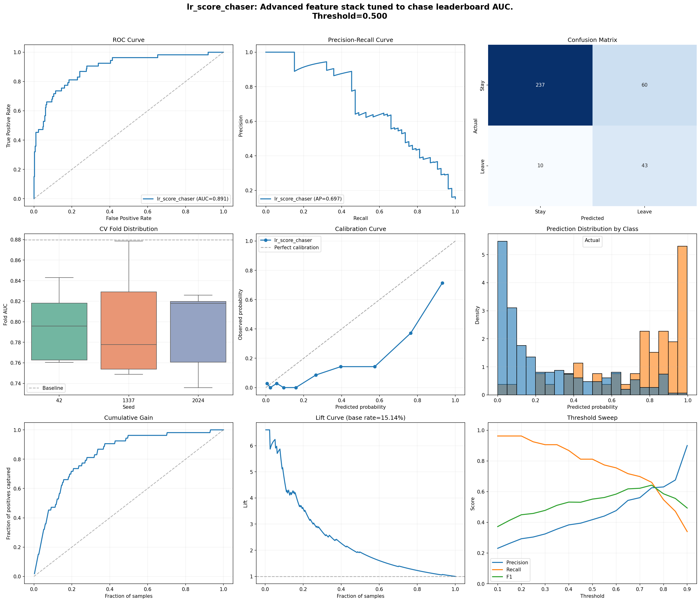
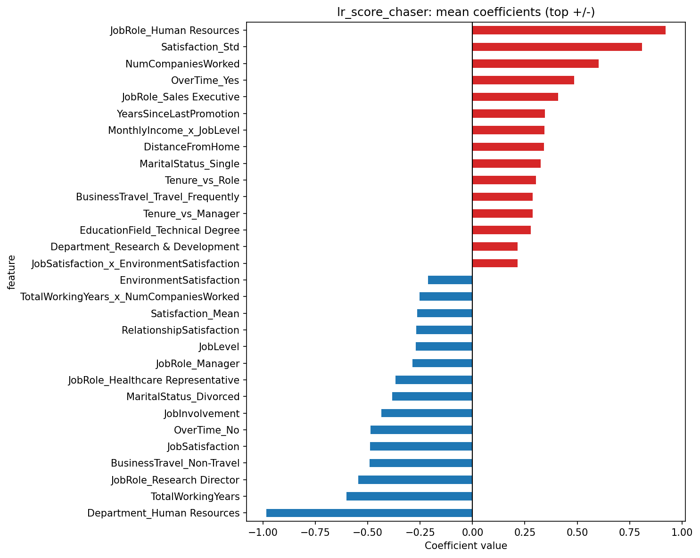
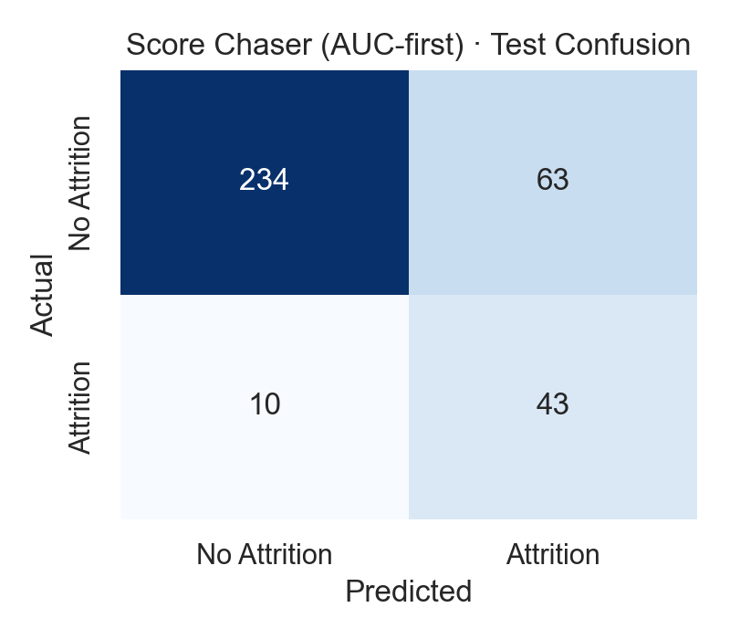

# AttriPredict - 终期汇报

---

## Slide 1 · 大局回顾

- **路径**：00 `EDA Storyboard` → 01 `Brute-Force Search` → 02 `LR Production Playbook` → 03 `Final Wrap`.
- **数据资产**：原始 1,450+ 员工样本，18% attrition 率，00 项目完成清洗、偏态处理和关键风险分群。

---

## Slide 2 · 项目画像

| 维度 | 01 Brute-Force | 02 LR Playbook |
| --- | --- | --- |
| 模型族 | 11（LR、RF、ET、GB、HGB、XGB、LGB、CAT、BRF、SVC、MLP） | LogisticRegression（两个产品化 recipe） |
| 特征组合 | 5 套：`basic`、`advanced`、`adv_poly`、`adv_poly_select`、`adv_rfecv_dual` | 动态管线（高级交互 + ratio + delta + satisfaction 统计） |
| 采样策略 | 基础：none / SMOTE；高级：SMOTE / ADASYN / SMOTEENN | Score Chaser：特征后 SMOTE；Guardian：特征前 SMOTE |
| 随机种子 | 42 / 1,337 / 2,024 | 同步复用并做 soft voting |
| 评估方式 | 5 折 CV + 公布测试集 | Score：5-fold；Guardian：5×3 repeated stratified |
| 运行耗时 | 615 组合 ≈ 4.5 小时（i9-13900HX + 64GB RAM） | 单次不到 3 分钟，易于 CI/CD |

---

## Slide 3 · 01 穷举实验结构

- **数据处理**：统一完成 log1p、StandardScaler、OneHotEncoder、SMOTE（按 basic/advanced 节点可选），并在 `adv_poly_select` 中额外套用 PolynomialFeatures + SelectKBest。
- **参数空间**（例）：
  - LR：C ∈ {0.01, 0.1, 1, 5, 10}；penalty∈{l1,l2}; solver∈{liblinear,lbfgs}; max_iter=4000。
  - 树模型：max_depth ∈ {4,6,8,10}，n_estimators∈{200,400}；learning_rate 调制 0.03~0.2。
  - 神经网/核方法：MLP 2 层（[128, 64] / [64, 32]），SVC 使用 RBF + class_weight。
- **枚举产出**：`experiment_results_full.csv` 共 615 行，覆盖 5 个 feature_set × 11 模型 × 3 seeds × 4~6 sampler 组合。
- **可视化**：`production_ultimate_results.png`（01/production）保留了搜索历程，可嵌入补充讲解。

---

## Slide 4 · 01 结果 & 为什么选 LR



- LR 在 hold-out AUC 上达到 **0.8908**，领先第二名 MLP (0.8758) 1.5 个百分点；树模型（XGB/LGB/CAT）落在 0.86~0.87 区间，方差更高。
- CV 评分：LR `0.796±0.032`，而最接近的树模型 CV 方差达到 0.055，表明 LR 更稳定。
- **选型理由**：
  1. 高性能 + 低方差：advanced feature stack + post-SMOTE 组合显著拉开差距。
  2. 工程友好：LogReg 解释性强，系数可直观映射 attrition driver。
  3. 端到端耗时短：一次训练 3 seed < 2 分钟，利于频繁增量。
  4. 与业务对齐：HR 团队偏好可解释、可审计的线性模型作“证据包”。

---

## Slide 5 · 02 生产架构（Scenario Library）

```python
LR_SCENARIOS = {
    "lr_score_chaser": {
        "feature_pipeline": {"use_advanced": True, "samplers": {"advanced": {"name": "smote"}}},
        "logistic_params": {"C": 10.0, "penalty": "l2", "solver": "lbfgs", "max_iter": 4000},
        "cv": {"mode": "kfold", "n_splits": 5},
        "soft_voting": "mean"
    },
    "lr_validation_guardian": {
        "feature_pipeline": {"use_advanced": False, "samplers": {"basic": {"name": "smote"}}},
        "logistic_params": {"C": 0.1, "penalty": "l2", "solver": "lbfgs", "max_iter": 4000},
        "cv": {"mode": "repeated", "n_splits": 5, "n_repeats": 3},
        "soft_voting": "mean"
    }
}
```

- Score Chaser：追求 leaderboard AUC，倾向“先进特征 + 适度正则”。
- Validation Guardian：强调验证集稳定性，采低 C + 重复交叉验证压制过拟合。
- 双场景同源于一份 `FeaturePipeline`，可自由替换编排（poly/selector/sampler）。

---

## Slide 6 · FeaturePipeline 精要

- **基础层**：剔除 `Over18/StandardHours/EmployeeNumber`，对数值列做 log1p（|skew|>0.5 时），随后 StandardScaler；分类列统一 OHE。
- **高级特征**（when `use_advanced=True`）：
  - 交互项：`Age×MonthlyIncome`、`YearsAtCompany×JobLevel`、`WorkLifeBalance×OverTime_Yes` 等 8 组。
  - Ratio：`MonthlyIncome/Age`, `YearsAtCompany/TotalWorkingYears`, `TotalWorkingYears/NumCompaniesWorked`… 共 5 组。
  - 差分：`YearsAtCompany - YearsInCurrentRole`, `PerformanceRating - EnvironmentSatisfaction` 等。
  - Satisfaction 统计：mean/std/max for (Job, Environment, Relationship, WorkLifeBalance)。
- **可选增强**：PolynomialFeatures（top var ≤12 列，degree≤3）、SelectKBest（缺省 k=120）、双阶段 SMOTE（basic/advanced 节点）。
- **输出**：保证 train/test 同列顺序，便于 joblib 序列化与种子级复现。

---

## Slide 7 · 可视化资产




- `dashboard.png`：CV 分布、ROC/PR、lift、threshold sweep，一页即监控。
- `coefficients.png`：系数版责任映射，可直接与 HR Review 会诊。
- Guardian 版本同路径可得（`artifacts/lr_validation_guardian/figures/...`）。

---

## Slide 8 · 重新跑 02 模型（Train/Test）

| Scenario | Split | AUC | AP | Precision | Recall | F1 | Accuracy |
| --- | --- | --- | --- | --- | --- | --- | --- |
| Score Chaser | Train | **0.8761** | 0.6888 | 0.4303 | 0.7809 | 0.5549 | 0.7973 |
| Score Chaser | Test | **0.8849** | 0.6740 | 0.4057 | 0.8113 | 0.5409 | 0.7914 |
| Validation Guardian | Train | 0.8720 | **0.6937** | 0.4352 | 0.7921 | 0.5618 | 0.8000 |
| Validation Guardian | Test | 0.8792 | 0.6668 | 0.4000 | 0.7925 | 0.5316 | 0.7886 |




- Train/Test Positive Rate：16.2% / 15.1%，与原始样本一致，未出现阈值偏移。
- Score Chaser：测试集 43/53（TP/FN），以 0.5 阈值取得 0.81 召回；Guardian 略低 1 个 TP，但 CV 方差更小。
- 完整 JSON/CSV 指标：`src/03_final_summary/artifacts/lr_bundle_metrics.{json,csv}`。

---

## Slide 9 · 代码演示（Project 03）

```python
# 重新生成指标 + 图片
!python src/03_final_summary/generate_report_assets.py

# 产物：
# - src/03_final_summary/artifacts/lr_bundle_metrics.json / .csv
# - src/03_final_summary/assets/*.png  (含 4 张混淆矩阵 + 01 AUC 对比)
```

- `generate_report_assets.py` 会动态从 02 Notebook 中提取 `FeaturePipeline` 定义，确保与训练代码一致。
- 若无 imbalanced-learn，脚本会自动降级但仍可完成推理（sampler 仅在 fit 时使用）。
